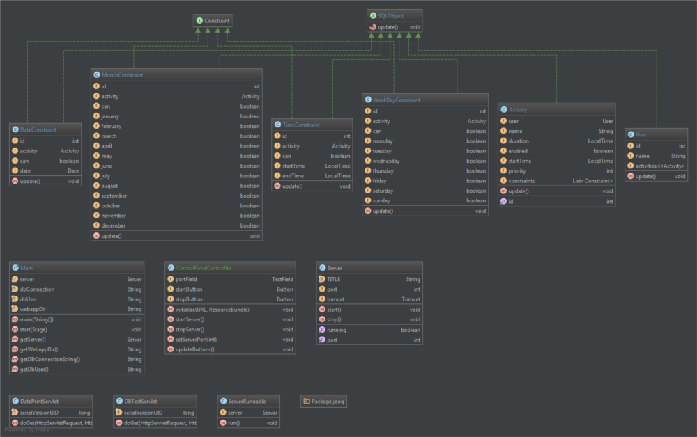

# Scheduler

An application by Team Scheduler  
CSC 413 Advanced Software Development I  
Spring 2015

<br>
##Overview of the software
The scheduler is an application that allows users to view possible schedules for activities during a given period of time. It also allows users to create conditions for activities or groups of activities, such as when a user wakes up, or what times the user would prefer to go to the gym. Given these activities and conditions, the application provides optimal schedule options for the user for the given period of time.

---

<br><br><br>
# Introduction

---

##Initial requirements
The basis for the project was to create an application that implemented a database and web-based user interface. Our software would create a locally hosted database that communicated with the application and saved user created activities and constraints into the database. We planned to use a Java graphical user interface library, called JavaFX, to create the web interface the user would interact with.

---

##Scope
The functional aim of the project, at launch, was to create an interactable user interface to which activities/events with constraints, such as the duration, time, and date of an activity, could be scheduled by the user. In the case that the user does not input a specific time or date for an event, the application will give the user an optimized schedule that includes each activity.

---

##Team
* Justin Fern
* Kyle Huntsman
* Brandon Olson
* Nathan Reline

---

##Goals
In order to complete the project, the team had to become familiar with databases and web servers. To provide a uniform build system, while using version control between the team members, we sought out to learn Maven and the other benefits it brought with it, which included making the build process easier within our environment and giving guidelines for practices during development. In relation to the scope of the project, we decided that the best option for calculating the most optimized schedule for the user was by using a genetic algorithm, another field we had yet to approach. Last, but not least, was the front end development. Members of the team either used JavaFX for the first time and learned how to use the software platform or furthered their knowledge and efficiency for better future usage.

<br><br><br>
#Technical Specs

---

##Software Architecture
For this project, we implemented a number of different tools that ended up in our project architecture.

* Java
* JavaFX
* Apache Tomcat
* H2 Database
* jOOQ
* Maven

###Java
We chose Java as our primary programming language because of Java's powerful code-once run everywhere mentality. We also chose Java to take advantage of the JavaFX library, which is a library included in the Java Development Kit that aids in the creation of graphical user interfaces.

If you'd like to learn more about Java, click [here](https://www.java.com/en/about/).

###JavaFX
After some research on JavaFX, we found we could run JavaFX applications in a browser, which would allow us to use our Java code and our existing knowledge of JavaFX to create the web interface. See [creating the web interface](index.md#creating-the-web-interface) for more information.

If you'd like to learn more about JavaFX, click [here](http://docs.oracle.com/javase/8/javafx/get-started-tutorial/jfx-overview.htm#JFXST784).

###Apache Tomcat
Apache Tomcat was chosen over other Java servers, because research showed it to be the most supported, and really well documented. It also came with an embeddable version, which allowed us to easily embed a server instance into our application. With the tomcat server embedded into the application, we didn’t have to worry about the user needing to setup a standalone server and managing the apps that are installed on the server.

If you'd like to learn more about Apache Tomcat, click [here](http://tomcat.apache.org/).

###H2 Database
H2 Database was our database of choice, because of it's Java compatibility, it's size, and it's ability to run in embedded mode. With the database embedded in the application, we minimize the amount of work the user has to do to run and maintain the application.

If you'd like to learn more about H2 Database, click [here](http://www.h2database.com/html/main.html).

###jOOQ
jOOQ was nifty library found early in development, that aids in writing SQL code in Java. The syntax is really intuitive, and helped maked things visually cleaner in the code. With a little setup, it generates classes that represent your tables, and then those classes can be used within the SQL statements. Here’s an example from our database test servlet.
```java
// Add users to the USER table
database.insertInto(USER, USER.USER_NAME)
    .values("Justin")
    .values("Kyle")
    .values("Brandon")
    .values("Nathan").returning().fetch();
```

If you'd like to learn more about jOOQ, click [here](http://www.jooq.org/).

---

##UML

*Above is the class diagram for the Scheduler application*

An explanation of most of the classes shown in the class diagram can be found in [classes explained](index.md#classes-explained).

---

##Classes explained
Here, we will explain the classes that make up the application, and a little about how they were designed.

###Activity
Starting at the beginning, we have the Activity class. An activity is something somebody starts during their day, and continues doing for some amount of time. Therefore, the Activity class was given a start time and a duration. However, there might be a few rules about an activity, such as if it repeats, and on what days it doesn’t repeat. These rules have been created, and are represented by the Constraint classes talked about in [constraints](index.md#constraints).

###Constraints
Constraints are the rules that govern when an activity may take place. All the rules were designed with the ability to automatically optimize the schedule for the user in mind. We have come up with a few constraints, that will be briefly discussed with examples.

####Time Constraint
A constraint that gives an activity a period of time in which it can, or cannot exist.
> I’d like to gym today, but only between the hours of 9:00am and 5:00pm.

####Weekday Constraint
A constraint that gives an activity weekdays in which it can, or cannot exist.
> I’d like to go swimming this week, but only on Mondays and Wednesdays.

####Month Constraint
A constraint that gives and activity months in which it can, or cannot exist.
> I’d like to plant flowers this year, but only in the months of April and May.

####Date Constraint
A constraint that gives an activity a date in which it can, or cannot exist.
> My birthday falls on the 8th of July.

###SQLObject
Both the activity class and the all of the constraint classes are pretty much 1-to-1 copies of their database counterparts. The classes were designed with the database tables in mind to make reading and writing objects into the database easier.

With that, each class that was going to have instances of itself be in the database inherit from SQLObject. The idea for this was to make sure all of the classes had and update function, which would be used to update each field in the database that corresponded to that particular object, making the reading and writing of objects easy for ourselves.

###Server
This class holds the embedded Apache Tomcat server, a port number for accessing the server, and functions for starting and stopping the server. This class isn’t too extreme, and the code behind it is pretty simple. Upon initialization, a tomcat server instance is created.
```java
public Server() throws ServletException {
    tomcat = new Tomcat();
    running = false;
}
```
When the server object is started, it set’s the server port number, starts the tomcat server, and then waits for connections.
```java
public void start() throws LifecycleException {
    System.out.println("Starting Tomcat Server on port " + port);
    running = true;
    
    // All initialization should be done before the tomcat object is touched
    tomcat.setPort(port);
    tomcat.start();
    tomcat.getServer().await();
}
```
Stopping the server object stops the tomcat server instance.
```java
public void stop() throws LifecycleException {
    System.out.println("Stopping Tomcat Server...");
    running = false;
    
    // All objects must be stopped before tomcat is touched
    tomcat.stop();
}
```

---

##Database
As mentioned before, we chose to use H2 Database for our database implementation. We opted to run H2 in embedded mode, which would allow the database to exist within the application, and create less hassle on the user’s end by not requiring them to run an external database.

The tables in the database were optimized to third normal form to keep data from being duplicated within the database. Duplicated data is never a good idea, as data that needs to be changed would have to be changed in multiple tables, making the work harder for ourselves.

As for connecting to the database, there was very minimal code. First, in the main class, there are some variables that hold the H2 connection string, and the username for logging into the database.
```java
public class Main extends Application {

    private static Server server;
    private static final String dbConnection = "jdbc:h2:./db/scheduler";
    private static final String dbUser = "sa";
    …
}
```
Then to connect, we just need to establish a connection using those variables.
```java
Connection conn = DriverManager.getConnection(Main.getDBConnectionString(), Main.getDbUser(), "");
```
Using the connection object, we can then use jOOQ to write or read from the database.
```java
DSLContext database = DSL.using(conn);

// Add users to the USER table
database.insertInto(USER, USER.USER_NAME)
    .values("Justin")
    .values("Kyle")
    .values("Brandon")
    .values("Nathan").returning().fetch();

// Runs the equivalent of SELECT * FROM USER
Result<Record> result = database.select().from(USER).fetch();
```
---

##Web Interface
As stated above, we chose to use a JavaFX application as our web interface. A couple members of the team had experience using JavaFX before, and it came as a natural choice for our web interface after choosing Java as our main language, as the two would come together really nicely.

###Creation
The graphical user interface is designed either by typing out FXML manually, which is JavaFX’s implementation of the XML language for use with their JavaFX library, or with Scene Builder. Scene Builder is an application by Oracle, the makers of Java and JavaFX, to aid in the creation of JavaFX forms. It uses drag-and-drop containers and controls that allow the user to graphically design a form, with little to no programming involved. After the form is designed in Scene Builder, the form is saved as an FXML file. Whether the file is written manually, or created in Scene Builder, an FXML file is produced.

If you’d like to learn more about Scene Builder, click [here](http://www.oracle.com/technetwork/java/javase/downloads/javafxscenebuilder-info-2157684.html).

Once the form was created, a controller class was made to program the logic behind the buttons and fields, and tie them to other functions within the application. The form is is then told about the controller class, and everything starts to work like magic.

As a side note, this was also the exact process used when creating the server control panel. It is also a JavaFX application.

###Running in the browser
This is where the team became a little lost. After many hours of research, we found that to run a JavaFX application in the browser, there were a couple different options available to us. We could either have the application run in the browser, or have the application be downloaded by the browser and started natively on the machine. However, to do any of this, we have to generate a jnlp file and an html page.

After scouring the web for answers on how to generate this jnlp file, we found very little. Much of the documentation we found was either for the old version of JavaFX, or was simply unhelpful. After some tinkering, we eventually found that the IDE we were using, IntelliJ, could actually produce one of these jnlp files for us. By setting up the project to build a JavaFX application artifact, which is basically a bundled package, we were able to produce a jnlp file. We don’t actually have this file anymore, and more information about this problem can be found in [jnlp problems](index.md#jnlp-problems).


<br><br><br>
#Conclusion

---

##What we completed
In the end we completed the basis for a scheduling web-interface application with a client-server model. Firstly, we were able to create a server that the user was able to launch on the host computer. The server has an interface in which a user can specify a port, launch the server, and end the server. On the client-side, the user is able to launch a web browser and connect to the server to give the user access to the client interface. Using the client interface, a user is able to create very simple activities, specifying a start time and duration. 

---

##What had to be scrapped
Currently the application is not able to send information between the server and the client. This means the data created by the application is stored client-side only and cannot be stored on a server. The information that the user can create on the client-side is very limited; the user cannot name activities, remove or edit activities, or create recurring events. Originally the application was going to include several other features such as an automated schedule optimization tool, multiple activity layers, and user logins. These features had to be scrapped due to a combination of complications during development and lack of time. See [problems faced](index.md#problems-faced) for more information.

---

##Problems faced
During the development of the scheduler application, the development team ran into a myriad of problems that hindered development. Some of the problems were created at the beginning of the project when the project’s scope was defined. Later on in the project’s development, we determined that we were not going to have enough time to complete the project.

###So much technology
At first, the team was unsure as to what technologies we wanted to use within the application. Having never created a program consisting of a database, web interface, and embedded server, there was a lot of back and forth between different servers, databases, and approaches to the web interface. This often lead to confusion within the team, and time lost for development, as different technologies were being introduced and thrown away within days of each other.

###Super security
While attempting to get the client running in the browser, it became apparent after many warning messages, that there was no easy way the client was going to run in the browser without turning off all security. Running Java applications in a browser requires your application to be signed by an official certificate, which lets the browser know that the Java application it’s trying to run is not going to harm the user. This was never taken into account, and being the end of the semester, this was not going to be fixed.

###JNLP problems
There was very little documentation that could be found about how to produce this much needed jnlp file. The file would allow the client, which was a JavaFX application, to run in the browser. After randomly meddling with the IDE we were using, IntelliJ, we realized we could make IntelliJ generate this file. After doing so, and turning off all security in the process stated in [super security](index.md#super-security), were we then able to get the client running in the browser. The problem is we still don’t know what this jnlp file is _completely_. Yes, we generated one, but what the heck is it? Again, with a lack of useful documentation, it was difficult to know.

###Connection issues
After turning off all Java browser security to get the client to run in the browser, the challenge was then to connect the server and the client so the client could make database calls. We realized that the server address would have to be given to the client upon start as a parameter, so the client knew how to access the server, and talk to it. The problem comes from not knowing what the jnlp file was, and how to manipulate it. We knew what had to be done, but with both time slipping away from us and not knowing how to manipulate the jnlp file, we labeled it a lost cause to focus on the development of the client interface.

###Other classes
Towards the end of the semester, the team was struggling to work on the project, as due dates for projects in other classes slowly approached. All of our plates were full, and the application sat at the bottom of it all. There was a moment in the end, where the team had realized the application had not been touched for three weeks.

---

##What we would do differently
If the team were to take on this project again with the knowledge that we have now, there would be a few things that would be tackled a little differently.

###Defined roles and tasks
Now understanding the parts that make up an application like ours, it’d be easier to delegate tasks to team members. In the beginning, not knowing what needed to be done was a challenge, because no one had a defined role or a specific task to accomplish. Having the know how of what’s needed, it would be easier to assign tasks.

###Not Java
Although Java is a wonderful programming language with an awesome code-once run-everywhere mentality, it’s a major pain when it comes to browsers. Java would probably not be used again for the web interface, and would most likely be replaced by something that has more support, such as HTML5 with Javascript.

###Project structure
There were strange dependency problems towards the end with the client and the server, and we feel it would have been really nice if both the client and server were separate entities altogether, and then combined in the end.

---

##Next Steps
With the semester over, and the application in it’s final state, it’s time to move on. We all agreed the project was a massive learning experience, and we all learned new tricks and techniques that we can take with us into future projects. The application will most likely never be touched again. We’re all sick of it.

###If you’re going to continue it...
If the application were to be continued, there are a few things that need to be discussed first.

As stated in [project structure](index.md#project-structure), the project structure needs to be fixed. It could have been because we were trying to tackle web app development completely wrong, but the structure never felt right. If the project were properly structured, I feel working on the project would go a lot smoother.

After the project structure is fixed, the infrastructure that makes the client interface run in a browser should be looked at. We couldn’t pass the jnlp file hurdle, due to problems outlined in [problems faced](index.md#problems-faced), but maybe somebody else can. What also comes with that is getting some kind of proper signature for the the application once it’s built, so the browser doesn’t yell at you twenty times, letting you know that what you’re about to run might blow up the world. We, again, didn’t have the time to look into this fully, but maybe somebody else does.

After that, the client interface would need to be finished. That wouldn’t take much compared to the first two obstacles, but still something that would need to be done.

After all that’s completed, the last thing would be to make sure all the database code is correct and works. After that, feel free to add any features you feel should be a part of the application.
